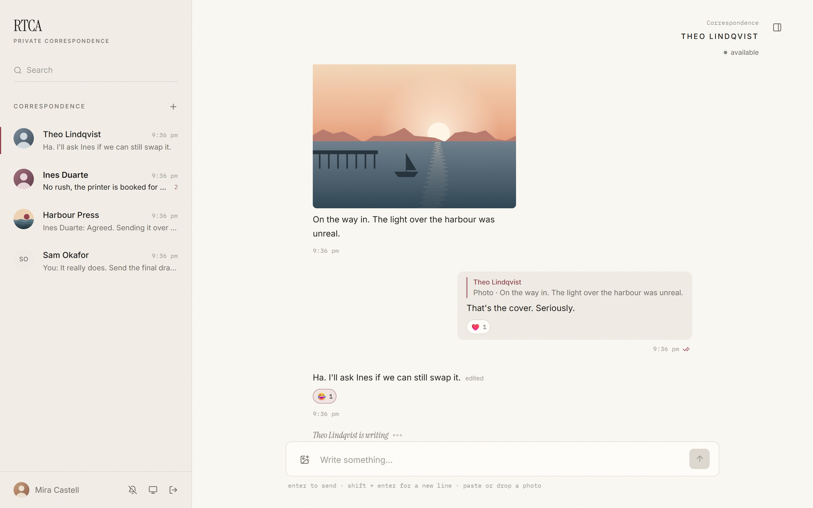
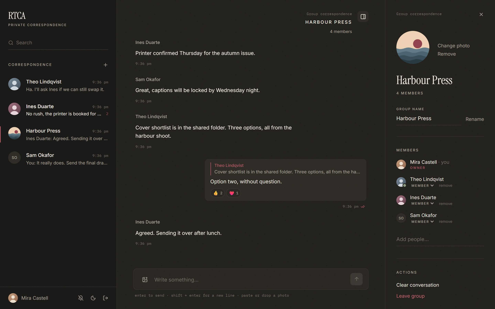
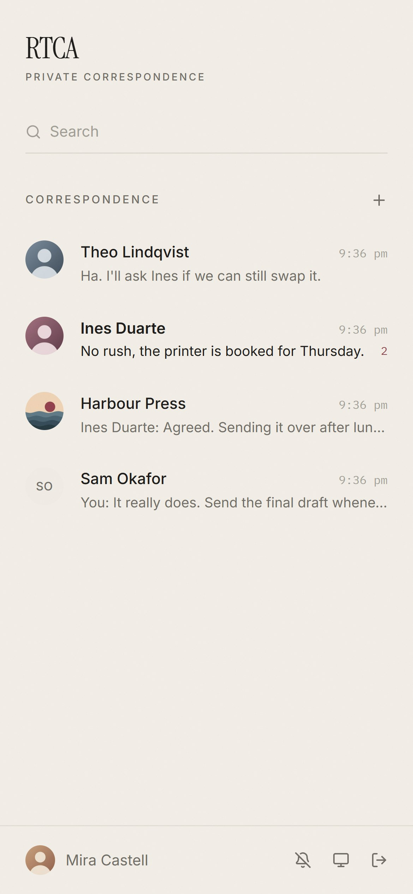
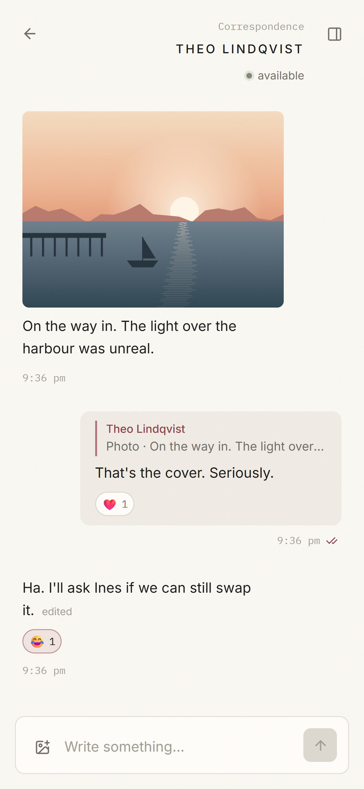
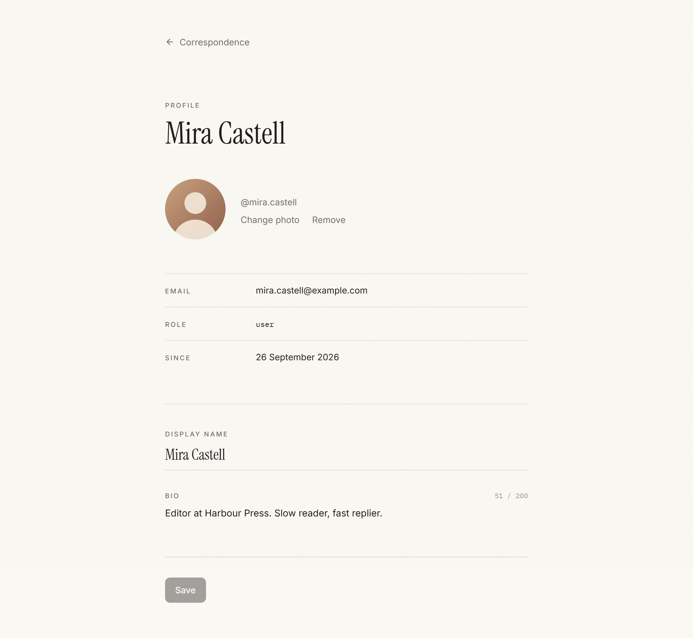

# Real Time Chat App

[](https://github.com/Abhishek-k03/RTCA/actions/workflows/ci.yml)

A backend for a real-time chat application built with Spring Boot. It supports one-to-one and group chats over WebSockets (STOMP), stores messages in PostgreSQL, and uses Redis for presence, caching, rate limiting and cross-instance fan-out.

## Screenshots

The React frontend in [`frontend/`](frontend) talks to this backend over REST and STOMP.

A direct chat: a photo with a caption, a reply quoting it, reactions, an edited message and the other person typing.



A group in dark mode, with the details panel open: group photo, members and roles.



On a phone, and the profile page with photo and bio.

<p align="center">
  
  
  
</p>

## Features

- Registration and login with short-lived JWTs and rotating refresh tokens, plus role-based access (`USER`, `ADMIN`)
- Direct (1:1) and group conversations with owner/admin/member roles
- Real-time messaging over STOMP, with a REST fallback
- Message history with cursor (keyset) pagination
- Idempotent sends: retrying the same `clientMessageId` never creates a duplicate
- Online/offline presence with multi-tab support and last-seen
- Typing indicators
- Delivery and read receipts, with unread counts
- Removed members keep a read-only copy of the group, up to the point they were removed
- New direct chats stay out of both lists until the first message
- Clear chat and delete chat, per user
- Edit messages and delete them for yourself or for everyone (within 15 minutes)
- Replies that quote the original message, and emoji reactions (one per member per message)
- Profiles with display name, bio and profile picture, and group photos. Name and photo changes show up live for everyone who shares a chat
- Image messages with an optional caption, only visible to members who can see that message
- Redis caching, per-user rate limiting, and pub/sub relay for running multiple instances
- Centralized validation and error handling for both REST and WebSocket
- Docker Compose setup with health checks

## Tech stack

Java 21, Spring Boot 3.5 (Web, Security, WebSocket, Data JPA, Validation, Cache, Actuator), PostgreSQL 16, Flyway, Redis 7, jjwt, Lombok, JUnit 5, Testcontainers, Docker.

## Architecture

```
Controller  ->  Service  ->  Repository  ->  PostgreSQL
    |              |
 STOMP handler     +-> Redis (presence, cache, rate limit, pub/sub)
```

Code is organized by feature, and each feature package is layered:

| Package | Responsibility |
|---|---|
| `auth` | register/login, JWT issue and validation, refresh tokens, security principal |
| `user` | profiles, search, admin user management |
| `conversation` | direct and group chats, membership, roles |
| `message` | sending, history, receipts |
| `file` | uploaded images: storage, type checks, access rules |
| `presence` | online status, typing indicators |
| `websocket` | STOMP config, auth/subscription interceptors, event publishing, redis relay |
| `common` | config, exceptions, shared DTOs, rate limiter |

The schema is managed by Flyway (`src/main/resources/db/migration`). Hibernate only validates it.

## Running

### With Docker

```bash
cp .env.example .env
docker compose up --build
```

The app runs on `http://localhost:8080`. If ports 5432 or 6379 are already in use, change `POSTGRES_PORT` / `REDIS_PORT` in `.env`.

To create an admin on startup, set `ADMIN_USERNAME` and `ADMIN_PASSWORD`.

### Locally

```bash
docker compose up -d postgres redis
./mvnw spring-boot:run
```

### Configuration

| Variable | Default | Notes |
|---|---|---|
| `DB_HOST` / `DB_PORT` / `DB_NAME` / `DB_USER` / `DB_PASSWORD` | `localhost` / `5432` / `rtca` / `rtca` / `rtca` | |
| `REDIS_HOST` / `REDIS_PORT` | `localhost` / `6379` | |
| `JWT_SECRET` | dev value | base64, at least 256 bits. **Set this in production** |
| `JWT_TTL` | `15m` | access token lifetime |
| `REFRESH_TTL` | `30d` | refresh token lifetime, renewed on every refresh |
| `REFRESH_COOKIE_SECURE` | `true` | marks the refresh cookie `Secure`. Browsers allow that on `localhost`; set `false` only for plain-HTTP access from another host |
| `WS_ALLOWED_ORIGINS` | `*` | comma separated |
| `MSG_RATE_LIMIT` / `MSG_RATE_WINDOW` | `20` / `10s` | messages per user per window |
| `MSG_EDIT_WINDOW` / `MSG_DELETE_WINDOW` | `15m` / `15m` | how long a sender can edit or delete for everyone |
| `RELAY_ENABLED` | `true` | Redis pub/sub fan-out |
| `FILES_DIR` | `./data/files` | where uploaded images are stored. `/data/files` (a volume) in Docker |

## REST API

All endpoints except `/api/auth/**` need an `Authorization: Bearer <token>` header. User and conversation ids are UUIDs; message ids are numeric and only visible to members.

| Method | Path | Description |
|---|---|---|
| POST | `/api/auth/register` | create account |
| POST | `/api/auth/login` | `{login, password}` returns an access token and sets the refresh cookie |
| POST | `/api/auth/refresh` | new access token from the refresh cookie. The refresh token is replaced each time |
| POST | `/api/auth/logout` | ends this session and clears the cookie |
| GET / PATCH | `/api/users/me` | own profile. PATCH `{displayName, bio}`, a blank bio clears it |
| PUT / DELETE | `/api/users/me/avatar` | set (multipart `file`, up to 2 MB) or remove your profile picture |
| GET | `/api/users/{id}` | public profile |
| GET | `/api/users/search?q=` | search by username/display name |
| GET | `/api/conversations` | my conversations with unread counts, most recent first |
| GET | `/api/conversations/{id}` | conversation details |
| POST | `/api/conversations/direct` | `{userId}` get or create a direct chat (hidden until the first message) |
| POST | `/api/conversations/{id}/clear` | hide all current messages, only for you |
| DELETE | `/api/conversations/{id}` | direct: clear and hide until the next message. group: only after leaving |
| POST | `/api/conversations/groups` | `{name, memberIds}` create a group |
| PATCH | `/api/conversations/groups/{id}` | rename (admins) |
| PUT / DELETE | `/api/conversations/groups/{id}/avatar` | set (multipart `file`, up to 2 MB) or remove the group photo (admins) |
| POST | `/api/conversations/groups/{id}/members` | add members (admins) |
| DELETE | `/api/conversations/groups/{id}/members/{userId}` | remove member or leave (the chat stays read-only for them) |
| PATCH | `/api/conversations/groups/{id}/members/{userId}/role` | change role (owner) |
| GET | `/api/conversations/{id}/messages?before=&after=&limit=` | history |
| POST | `/api/conversations/{id}/messages` | `{clientMessageId, content, replyToId?}` send |
| POST | `/api/conversations/{id}/messages/images` | multipart `file` (up to 10 MB) plus `clientMessageId`, `caption`, `width`, `height`, `replyToId`. Send an image |
| POST | `/api/conversations/{id}/messages/read` | `{messageId}` mark read |
| PATCH | `/api/conversations/{id}/messages/{messageId}` | `{content}` edit your own message |
| DELETE | `/api/conversations/{id}/messages/{messageId}?scope=me` | hide a message for yourself (no time limit) |
| DELETE | `/api/conversations/{id}/messages/{messageId}?scope=everyone` | delete your own message for all members |
| PUT / DELETE | `/api/conversations/{id}/messages/{messageId}/reaction` | `{emoji}` react (👍 ❤️ 😂 😮 😢 🙏), picking another replaces yours. DELETE takes it back |
| GET | `/api/files/{id}` | an uploaded image (profile picture or chat image) |
| GET | `/api/presence?userIds=1,2` | presence status |
| GET / PATCH | `/api/admin/users` | admin only |

Errors come back in one consistent shape:

```json
{ "timestamp": "...", "status": 400, "error": "Bad Request", "message": "Validation failed",
  "path": "/api/auth/register", "fieldErrors": { "email": "must be a well-formed email address" } }
```

## WebSocket (STOMP)

Connect to `ws://localhost:8080/ws` and send the token in the CONNECT frame:

```
CONNECT
Authorization:Bearer <token>
accept-version:1.2
```

| Direction | Destination | Payload |
|---|---|---|
| send | `/app/conversations.{id}.send` | `{clientMessageId, content, replyToId?}` |
| send | `/app/conversations.{id}.typing` | `{typing: true/false}` |
| send | `/app/conversations.{id}.delivered` | `{messageId}` |
| send | `/app/conversations.{id}.read` | `{messageId}` |
| subscribe | `/topic/conversations.{id}` | `MESSAGE`, `EDITED`, `DELETED`, `REACTION`, `GROUP_UPDATED`, `TYPING`, `DELIVERED`, `READ` events (members only) |
| subscribe | `/topic/presence.{userId}` | `PRESENCE` events |
| subscribe | `/user/queue/events` | `ACK` for your own sends, `ADDED` / `REMOVED` membership changes, `PROFILE` updates |
| subscribe | `/user/queue/errors` | errors from your frames |

Every event uses the envelope `{"type": "...", "payload": {...}}`.

- `ADDED {conversationId}`: you were added to a group, or someone sent the first message in a direct chat with you. Reload the conversation list.
- `REMOVED {conversationId, removedAt}`: you were removed from a group or left it. The chat is now read-only, stop using its topic.

- `EDITED {message}`: the full updated message, with `editedAt` set.
- `DELETED {conversationId, messageId}`: a message was deleted for everyone.
- `REACTION {conversationId, messageId, reactions}`: the message's full reaction list after a change.
- `GROUP_UPDATED {conversationId, name, avatarUrl}`: a group was renamed or got a new photo.
- `PROFILE {id, username, displayName, bio, avatarUrl}`: someone you share a chat with changed their profile. Chats that are still hidden don't count.

Conversation responses include `lastMessage` (the newest message you can see, for list previews, with its `type`) and `removedAt` when you are no longer a member. Messages include `editedAt`, and `deleted: true` with `content: null` once deleted for everyone. Image messages have `type: IMAGE`, the caption in `content`, and `image {url, width, height}`. Replies carry `replyTo {id, senderId, senderName, content, type, deleted}`, a short preview of the quoted message that follows its edits and deletes. `reactions` is a list of `{emoji, userIds}`. Users, participants and group conversations include `avatarUrl`.

## Design notes

### Idempotent message handling
The client generates a `clientMessageId` for each message and reuses it on retries. There is a unique constraint on `(sender_id, client_message_id)`, and messages are inserted with `INSERT ... ON CONFLICT DO NOTHING RETURNING id`:
- If a row is returned, the message is new. It gets broadcast, and the response is `201`.
- If nothing is returned, the message is a retry. The original is returned with `200` (or `duplicate: true` in the ACK), and nothing is broadcast again.

This holds under concurrent retries because Postgres decides the winner atomically.

### Concurrency
- **Direct chats:** each user pair has a unique `direct_key` (`minId:maxId`). Creation uses `ON CONFLICT DO NOTHING`, and the losing request re-reads the winner's row. Ten parallel "start chat" requests give one conversation.
- **Group edits:** `conversations.version` is checked with an `OPTIMISTIC_FORCE_INCREMENT` lock, so concurrent membership or rename changes can't silently overwrite each other. The loser gets a `409` and can retry.
- **Read/delivered receipts:** these are stored as pointers per participant. The updates use `WHERE last_read_message_id < :id`, so the pointers only move forward, and late or duplicate receipts do nothing.
- **Last message timestamp:** `lastMessageAt` is updated with a conditional bulk update. It never goes backwards and never conflicts with group edits.

### Membership changes
- **Removal keeps the row.** Removing a member (or leaving) sets `removed_at` and remembers the last message they may see. They keep read access to that history, cannot send or subscribe, and can delete the chat from their list.
- **Live cutoff.** The subscribe check only runs on SUBSCRIBE, so after removal the server drops the user's existing subscriptions to that topic on every instance (through the Redis relay) and sends them `REMOVED`.
- **Hidden direct chats.** Opening a direct chat creates it hidden for both users. The first message reveals it and sends `ADDED` to both.
- **Images.** Sending an image is one multipart request that stores the file and creates the message, with the same `clientMessageId` idempotency as text; a retry doesn't store the file twice. Only text messages can be edited. Deleting an image for everyone also deletes the file.
- **Edit and delete.** Only the sender can edit or delete for everyone, within `MSG_EDIT_WINDOW` / `MSG_DELETE_WINDOW`. Deleting for everyone wipes the content but keeps the row, so ids, cursors and receipts stay valid. Deleting for yourself adds a row to `message_hides`, which history and unread counts skip for that user.
- **Per-user views.** Clearing a chat stores a per-member `cleared_up_to_message_id`, so history and unread counts skip older messages for that user only. Deleting a direct chat clears and hides it, and the next message brings it back.

### Transactions
Service methods own the transaction boundaries, and reads are `readOnly`. Broadcasts run in `AFTER_COMMIT` listeners, so clients never see a message that was rolled back. Cache evictions for membership changes also run after commit, so a concurrent reader can't re-cache stale data.

### Scalability
- **Horizontal scaling:** every event is published to a Redis channel. Each instance delivers it to its own STOMP sessions, so users on different nodes can talk to each other.
- **Presence:** each user has a Redis sorted set of live sessions scored by expiry. A heartbeat refreshes the scores, so multiple tabs work and sessions from a crashed node expire on their own. Lua scripts keep connect/disconnect counting atomic.
- **History:** keyset pagination on `(conversation_id, id DESC)` stays fast at any depth, unlike `OFFSET`.
- **N+1 avoidance:** participants and unread counts for a page of conversations are loaded in one query each.
- **Hot-path caching:** membership checks run on every send and subscribe, so positive results are cached in Redis. User summaries are cached too.

### Failure handling
- **Redis is treated as an optimisation:**
  - If the relay can't publish, it delivers locally.
  - The rate limiter fails open.
  - Cache errors fall through to the DB.
  - Presence errors are logged and never break a socket.
- **Validation and errors:** all validation and domain errors map to clear HTTP statuses. WebSocket errors go only to the sender, on `/user/queue/errors`.
- **Rejected frames:** an unauthenticated CONNECT or a forbidden SUBSCRIBE gets a STOMP ERROR frame.
- **Operations:** graceful shutdown, readiness/liveness probes (DB and Redis), and container health checks.

### Security
- Stateless JWT auth, with BCrypt password hashes.
- Sessions:
  - Access tokens last 15 minutes and are kept in memory by the frontend, never in local storage.
  - The refresh token is an `HttpOnly`, `SameSite=Strict`, `Secure` cookie scoped to `/api/auth`, so scripts can't read it and other sites can't send it.
  - Only a SHA-256 hash of each refresh token is stored.
  - Every refresh replaces the token. If a replaced token is used again later, it has leaked, so the whole session is revoked. A 30 second grace period lets two tabs refresh at the same time.
  - Signing out revokes the session on the server. Role changes take effect at the next refresh.
- WebSocket sessions are authenticated on CONNECT, and every SUBSCRIBE to a conversation topic is checked for membership.
- Users and conversations are exposed only by random UUIDs (`public_id`) in URLs, request/response bodies, WebSocket topics and events; the numeric ids stay internal. Ids can't be guessed or counted, and the JWT subject is the public id too.
- Users who aren't members get `404` rather than `403`, so conversation ids don't leak.
- Uploaded files:
  - The type is checked from the file's first bytes (JPEG, PNG, GIF, WebP only), never from what the client sends, so SVG and HTML can't be uploaded.
  - Files are served only to signed-in users. Group photos only to members, including removed ones. A chat image follows the same rules as the message: removed members keep the images from before they left, and clearing a chat or deleting a message for yourself hides its image too.
  - Anything you can't see is a `404`, and file ids are random UUIDs.
- Sending is rate-limited per user across all instances.

## Testing

```bash
./mvnw verify
```

GitHub Actions runs the backend tests, the frontend lint and build, and the browser tests on every push to `master` and on pull requests.

- Unit tests cover the auth service and JWT handling. MockMvc tests cover the auth endpoints, the refresh cookie and error mapping.
- Integration tests use Testcontainers for real Postgres and Redis (Docker required). They cover:
  - concurrent direct-chat creation
  - idempotent sends
  - pagination with no gaps or duplicates
  - non-member access
  - unread counts
  - STOMP messaging end to end
  - group removal, re-adding and membership events
  - clearing and deleting chats
  - public ids: numeric or unknown ids are rejected, users can't be listed by counting
  - editing and deleting messages, including the time limit
  - refresh tokens: rotation, parallel refreshes, reuse revoking the session, logout and expiry
  - profiles, profile pictures and image messages: type checks, size limits, access for members, removed members and non-members
  - replies and reactions: quotes from other chats rejected, one reaction per member, live `REACTION` events
  - group photos and live updates: only admins can change them, members-only access, `PROFILE` events skip hidden chats
  - client mistakes (unknown path, wrong method or content type, missing parameter) get their 4xx status, not a 500
  - user search treats `_` and `%` literally
- Browser tests (Playwright, in [`frontend/e2e`](frontend/e2e)) drive the real app with two people signed in at once:
  - registration, sign-in that survives a reload, sign-out
  - live messages, typing, read receipts, edits and deletes
  - search, replies and jumping to the quoted message, reactions
  - photos (scaled down before upload), profile and group photos reaching others live
  - a removed member keeping a read-only copy of a group

  They need the backend on `localhost:8080`:

  ```bash
  cd frontend
  npx playwright install chromium   # once
  npm run test:e2e                  # PW_CHANNEL=msedge uses an installed Edge instead
  ```

## Possible improvements

- A denylist for access tokens, so sign-out also cuts off the current 15 minute token
- An external broker relay (RabbitMQ/ActiveMQ STOMP) instead of the simple broker plus Redis relay
- An outbox table for guaranteed event delivery when Redis is down for a long time
- S3-compatible storage behind `FileStorage` for running several instances without a shared volume
- Thumbnails, other attachment types and push notifications
